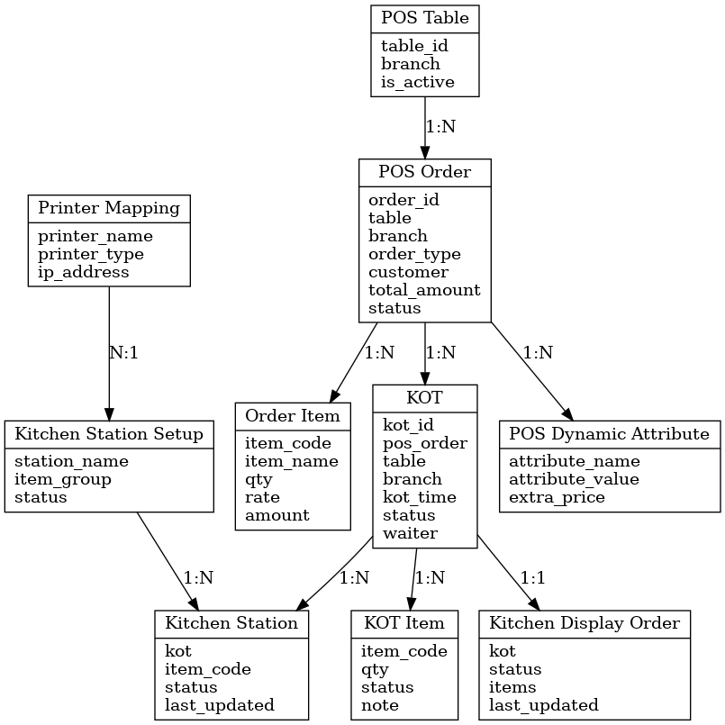

# Restaurant POS Core

Frappe app untuk mengelola operasional restoran modern.

## Fitur Utama
- Kitchen Order Ticket (KOT)
- Join Table
- Kitchen Display System (KDS)
- Second Screen Display

---

## Modul: POS Order

### Fungsionalitas
- Autoname otomatis berdasarkan cabang + tanggal
- Validasi cabang & station aktif
- Hitung total dan set status dari item

### Fields
- order_id, table, branch, order_type, customer
- items, total_amount, status, final_billed, sales_invoice

### Status
- Draft, In Progress, Ready for Billing, Paid, Cancelled

### Akses
| Role           | Hak Akses |
|----------------|------------|
| System Manager | CRUD       |
| Sales User     | CRU        |
| Waiter         | CRU        |

---

## Modul: POS Table

### Fields
- table_id, branch, is_active

### Akses
| Role           | Hak Akses |
|----------------|------------|
| System Manager | CRUD       |

---

## Modul: Kitchen Order Ticket (KOT)

### Fungsionalitas
- Buat otomatis dari POS Order
- Menampilkan item yang perlu dimasak

### Fields
- kot_id, pos_order, table, branch
- kot_time, items, status, waiter

### Status
- New, In Progress, Ready, Served, Cancelled

### Akses
| Role           | Hak Akses |
|----------------|------------|
| System Manager | CRUD       |
| Sales User     | CRU        |

---

## Modul: KOT Item

### Fields
- item_code, item_name, qty, note
- kot_status, cancelled, cancellation_note
- kot_last_update, dynamic_attributes
- waiter, order_id, branch

### Akses
| Role           | Hak Akses |
|----------------|------------|
| System Manager | CRUD       |

---

## Modul: Kitchen SLA Log

### Akses
| Role           | Hak Akses |
|----------------|------------|
| System Manager | CRUD       |

---

## Modul: Kitchen Station Setup

### Fields
- station_name, branch, item_group
- status, assigned_printers, print_format

### Akses
| Role           | Hak Akses |
|----------------|------------|
| System Manager | CRUD       |

---

## Modul: Kitchen Display Order

### Fields
- kot, table, branch, items
- status, last_updated

### Akses
| Role           | Hak Akses |
|----------------|------------|
| Kitchen Staff  | CRU        |
| System Manager | CRUD       |

---

## Modul: Kitchen Station

### Fields
- kot, status, table, branch
- item_code, item_name, attribute_summary
- note, kot_status, last_updated, cancelled, cancellation_note

### Akses
| Role           | Hak Akses |
|----------------|------------|
| Kitchen Staff  | CR         |
| System Manager | CRUD       |

---

## Modul: POS Dynamic Attribute

### Fields
- attribute_name, attribute_value
- mapped_item, extra_price, pos_order_item

### Akses
| Role           | Hak Akses |
|----------------|------------|
| Waiter         | CRU        |
| System Manager | CRUD       |

---

## Modul: Printer Mapping POS Restaurant

### Fields
- printer_name, printer_type
- printer_ip, bluetooth_identifier
- print_format

### Akses
| Role           | Hak Akses |
|----------------|------------|
| System Manager | CRUD       |

---

## API Highlights

### resolve_variant.py
- `resolve_variant(template, attributes)`

### kitchen_station.py
- `get_attribute_summary(dynamic_attributes_json)`
- `create_kitchen_station_items_from_kot(kot_id)`

### kds_handler.py
- `create_kds_from_kot(kot_id)`

### create_kot.py
- `create_kot_from_pos_order(pos_order_id)`

### get_available_tables.py
- `get_available_tables(branch)`

### get_attributes_for_item.py
- `get_attributes_for_item(item_code)`

### kds.py
- `create_kds_from_kot(kot_id)`

### sendkitchenandcancel.py
- `send_to_kitchen(pos_order)`
- `cancel_pos_order_item(item_name, reason)`
- `mark_all_served(pos_order_id)`

### kitchen_station_handler.py
- `get_kitchen_items_by_station(branch, item_group)`
- `update_kitchen_item_status(kot_item_id, new_status)`
- `cancel_kitchen_item(kot_item_id, reason)`

### kot_status_update.py
- `update_kds_status_from_kot(kds_name)`

---

## ERD

